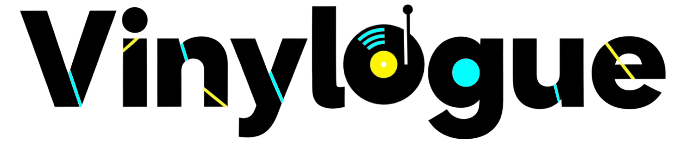
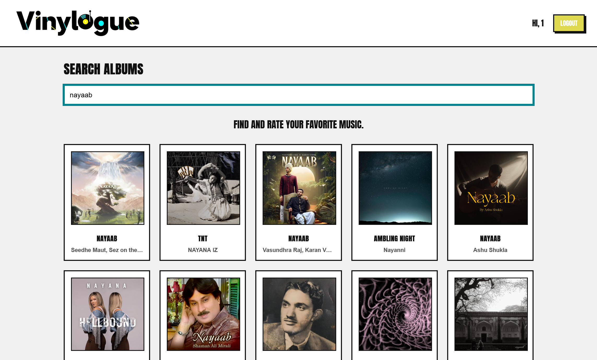
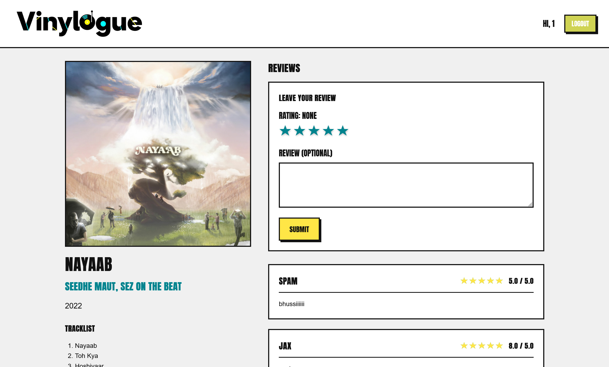

### Your Digital Record Shelf

*Built with the MERN stack and styled with a bold, brutalist aesthetic.*

Vinylogue is a full-stack web application for music enthusiasts to discover, rate, review, and catalog albums. Inspired by Letterboxd's model for film, Vinylogue provides an opinionated, functional, and stylish platform for logging your musical journey.

**Live Demo:** [https://vinylogue-project.vercel.app/](https://vinylogue-project.vercel.app/)

---

## 📸 Screenshots

### **Homepage**

Show off your logo and the clean, brutalist design.


### **Album Page**

Display the review form with the SVG star rating system and the red heart "like" button.


---

## ✨ Key Features

* **User Authentication:** Secure user sign-up and login using JSON Web Tokens (JWT).
* **Dynamic Album Search:** Search for any album using a debounced, real-time connection to the Spotify Web API.
* **Refined Search Results:** Backend logic filters out singles, compilations, and duplicate album entries for a clean user experience.
* **Album Rating & Reviewing:** Interactive SVG star rating system (supporting half-star ratings) and a text review form.
* **"Liking" System:** Users can "like" albums, which are then saved to their profile.
* **User Profiles:** A dedicated page for each user to display their liked albums collection.
* **Account Management:** Settings page for viewing details and permanently deleting the account and all associated data.
* **Responsive Design:** A clean and functional UI across devices.

---

## 🛠️ Tech Stack

| Category       | Technology                                     |
| -------------- | ---------------------------------------------- |
| **Frontend**   | React, Vite, React Router, Axios, CSS3         |
| **Backend**    | Node.js, Express.js, Mongoose                  |
| **Database**   | MongoDB (with MongoDB Atlas for cloud hosting) |
| **API**        | Spotify Web API                                |
| **Deployment** | **Frontend:** Vercel, **Backend:** Render      |

---

## 🚀 Getting Started

### Prerequisites

* Node.js (v18.x or later)
* npm
* Git

### Installation & Setup

1. **Clone the repository:**

   ```sh
   git clone https://github.com/Jalpan04/vinylogue-project.git
   cd vinylogue-project
   ```

2. **Install Backend Dependencies:**

   ```sh
   cd backend
   npm install
   ```

3. **Install Frontend Dependencies:**

   ```sh
   cd ../frontend
   npm install
   ```

4. **Set Up Environment Variables:**

   * In `/backend/.env`:

     ```env
     MONGO_URI=YOUR_MONGODB_ATLAS_CONNECTION_STRING
     PORT=5001
     JWT_SECRET=YOUR_SUPER_SECRET_JWT_KEY
     SPOTIFY_CLIENT_ID=YOUR_SPOTIFY_CLIENT_ID
     SPOTIFY_CLIENT_SECRET=YOUR_SPOTIFY_CLIENT_SECRET
     ```
   * In `/frontend/.env.local`:

     ```env
     VITE_API_URL=http://localhost:5001
     ```

5. **Run the Application:**

   * Backend:

     ```sh
     cd backend
     npm start
     ```
   * Frontend:

     ```sh
     cd frontend
     npm run dev
     ```

Open [http://localhost:3000](http://localhost:3000) to view the app in your browser.

---

## ☁️ Deployment

* **Backend:** Render (Root Directory: `/backend`)
* **Frontend:** Vercel (Root Directory: `/frontend`, `VITE_API_URL` set to Render live URL)

---

## 📄 License

Distributed under the MIT License. See `LICENSE` for more information.

---

If you want, I can also **center the logo at the top and make the screenshots appear side-by-side** so the README looks more like a polished landing page.
Do you want me to style it that way?
